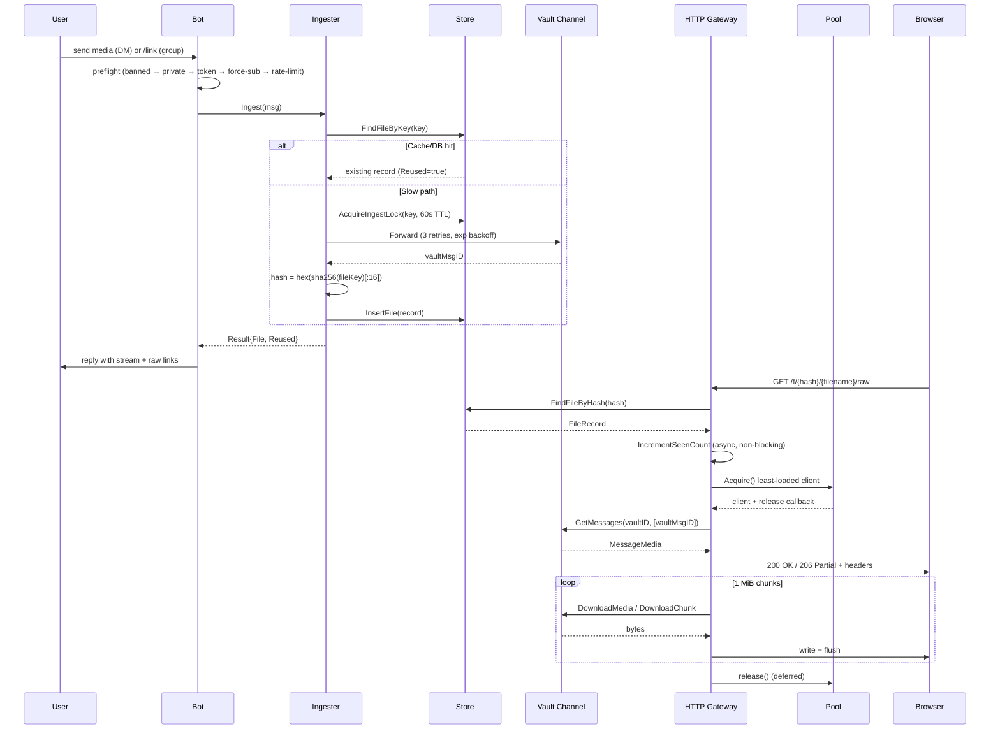
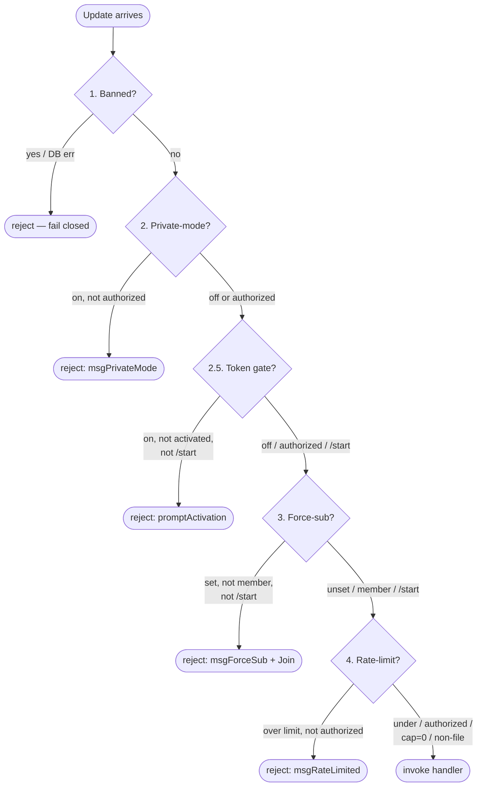

# Architecture

How ThunderGo is put together. For deployment see [DEPLOYMENT.md](DEPLOYMENT.md); for env vars see [CONFIGURATION.md](CONFIGURATION.md); for HTTP routes see [API.md](API.md); for security see [../SECURITY.md](../SECURITY.md).

---

## System Overview

```mermaid
flowchart TB
    subgraph Telegram["Telegram Network"]
        User["Telegram User"]
        Vault["Private Vault Channel"]
    end
    subgraph App["ThunderGo Process (single binary)"]
        Bot["bot<br/>commands + preflight"]
        Ingest["ingest<br/>dedup + forward to vault"]
        Pool["pool<br/>1 primary + N download-only clients"]
        Store["store<br/>MongoDB + in-memory caches"]
        Stream["stream<br/>HTTP byte streamer (Range)"]
        HTTP["http<br/>chi router + player page"]
        RL["ratelimit<br/>per-user GCRA"]
        SH["shortener<br/>external API + LRU cache"]
    end
    subgraph Mongo[("MongoDB")]
        Cols["users, files, banned, authorized,<br/>activation_tokens, file_ingest_locks"]
    end
    Browser["Web Browser / Player"]

    User -->|"/link, file upload"| Bot
    Bot -->|media| Ingest
    Ingest -->|Forward (hide author)| Vault
    Ingest -->|InsertFile| Store
    Bot -->|preflight: banned / private / token / force-sub / rate-limit| Store
    Bot -->|preflight: rate-limit| RL
    Bot -->|shorten links for non-authorized| SH
    Store --> Cols

    Browser -->|"GET /f/{hash}/file"| HTTP
    HTTP -->|FindFileByHash| Store
    HTTP -->|Acquire least-loaded client| Pool
    Pool -->|GetMessages + DownloadMedia| Vault
    HTTP -->|stream 1 MiB chunks| Browser
```

---

## Components

| Component | What it does |
|---|---|
| `cmd/thundergo/main.go` | Entry point. Parses `-healthcheck` flag, runs `app.App`. |
| `internal/app` | Wires config + logger + Mongo + pool + bot + HTTP server. Ordered graceful shutdown on SIGINT/SIGTERM (HTTP → sweeps → bot → pool → Mongo). Startup/shutdown bounded to 30s. |
| `internal/config` | Loads `.env` + `.env.local`, parses env vars via `caarlos0/env/v11`, validates, derives listen port from `TG_URL`. |
| `internal/bot` | Telegram bot. Command dispatch (semaphore cap 128, goroutine per update with panic recovery), pre-flight chain, activation prompts, owner commands. |
| `internal/ingest` | File ingestion + dedup. Per-file-key mutex + cross-process Mongo lock (TTL 60s). Fast path: cache hit → reuse. Slow path: forward to vault, insert record. |
| `internal/pool` | 1 primary client (receives updates) + N secondary clients (download-only) per `TG_EXTRA_BOTSN`. Least-loaded selection under `TG_MAX_CONCURRENT_PER_CLIENT`. Flood-wait aware. |
| `internal/store` | MongoDB persistence + in-memory caches (file-by-hash, file-by-key, banned, authorized, activated). TTL indexes auto-expire tokens, activations, locks. |
| `internal/stream` | HTTP byte streamer. Resolves vault media → sets headers → streams 1 MiB chunks. Range support. Full-body and Range downloads are sequential 1 MiB transfers driven by the request context. |
| `internal/http` | chi router. CORS wildcard. `redactPath` masks `/f/{hash}/...` and `/activate/{token}` in access logs. `go:embed`-s the player HTML. |
| `internal/ratelimit` | Two limiters: **per-user GCRA** (16 shards, atomic CAS, 60-second window, disabled when `TG_RATE_LIMIT=0`) + **global token-bucket** (`TG_GLOBAL_RPS`, burst hardcoded to 2× RPS, disabled when `TG_GLOBAL_RPS=0`). Owner + authorized bypass both. In-memory. |
| `internal/shortener` | Calls external shortener API. LRU cache (10k) + `singleflight` dedup. Host-mismatch validation (open-redirect defense). Disabled when `TG_SHORTENER_API_KEY` empty. |
| `internal/tgutil` | Crockford base32, filename extraction, MIME fallback, Range parsing, Content-Disposition escaping (RFC 6266/5987), `TokenHash` for log correlation. |
| `internal/log` | `slog` multi-writer (stdout + lumberjack rotating file, 100 MiB / 5 backups / 14-day retention). On ephemeral PaaS filesystems the file is a no-op; stdout is what the platform drains. |
| `web/templates/player.html` | `go:embed`-ed HTML player (Vidstack from CDN). |

---

## Request Lifecycle



- **Dedup**: the file key (Telegram-internal `PackBotFileID`) is hashed with SHA-256 → 32-hex-char hash (first 16 bytes). Same file always produces the same hash → same URL.
- **TTL is on `created_at`** (conversion time), not `last_seen_at`. `TG_FILE_TTL_DAYS` removes the DB record N days after ingestion, regardless of access. The vault message is NOT deleted.
- **TTL index** on `files.created_at` runs in MongoDB; the bot has no background sweeper for file expiry.

---

## Pre-flight Chain

Every bot update runs through `bot.preflight(c)`. The owner bypasses the entire chain. Chain order:



| Step | Owner | Authorized | `/start` |
|---|---|---|---|
| 1. Banned | no bypass | no bypass | no bypass |
| 2. Private-mode | bypass | bypass | bypass (entire chain) |
| 2.5 Token activation | bypass | bypass | always passes (delivers token) |
| 3. Force-sub | bypass | no bypass | always passes (can join via button) |
| 4. Rate-limit | bypass | bypass | n/a (not a file request) |

- **Fail-closed**: DB errors in steps 1 and 2.5 deny the request.
- **Rate-limit scope**: only file requests (`/link` and private media ingestion). Non-file commands like `/ping` are never rate-limited.

---

## Concurrency Model

Single process, multi-goroutine.

- **Bot dispatch**: one goroutine per update, bounded by a semaphore of 128.
- **HTTP handlers**: one goroutine per request, managed by `net/http`. Streaming downloads bypass read/write timeouts; the stream handler's own timeout formula (max 30 min) bounds duration.
- **Pool per-client cap**: `TG_MAX_CONCURRENT_PER_CLIENT` (default 8). Requests are rejected with a short retry response when every client is at the cap.
- **Background sweepers**: 6 cache sweepers (5-min), dedup-mutex cleanup (10-min), rate-limiter sweep (5-min), HTTP keepalive (`TG_KEEPALIVE_SECS`, default 300s).
- **Worker pools**: broadcast = 4 workers, link batch = 5 workers.

### Shutdown Ordering

On SIGINT/SIGTERM, `app.Run()` performs ordered graceful shutdown:

1. Cancel restart goroutine
2. `HTTP.Shutdown(ctx)` — drain in-flight HTTP requests
3. Stop background sweeps
4. `Bot.Stop()` — wait for in-flight handlers (wrapped with a context deadline in `Run()`)
5. `Pool.Stop(ctx)` — stop every client in parallel
6. `Store.Close(ctx)` — stop cache sweepers, disconnect Mongo

Errors are aggregated via `errors.Join` so a failed subsystem is visible to the supervisor (Docker restart policy / systemd).
